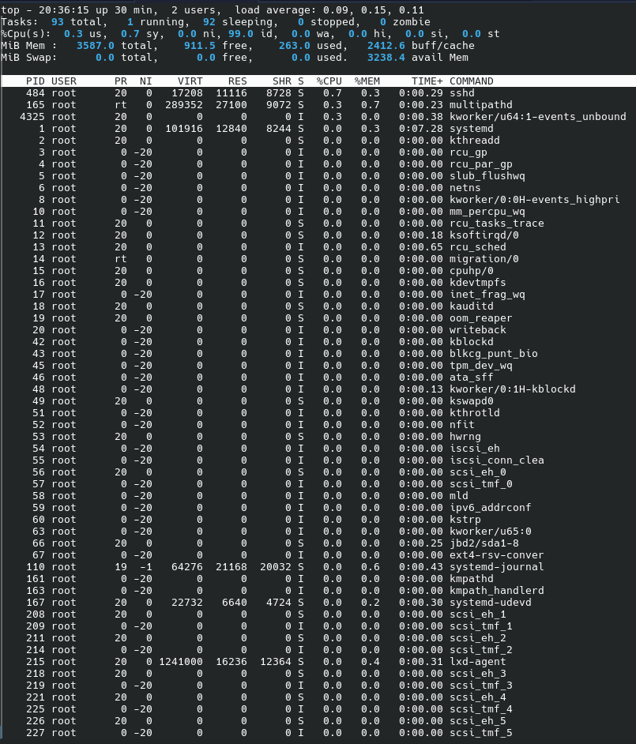

## Rapport laboratoire 00
### Guillaume Jarry  - JARG6630201
### ÉTS - LOG430 - Architecture logicielle - Été 2026

--- 

## Questions

---

### 1. Si l'un des tests échoue à cause d'un bug, comment pytest signale-t-il l'erreur et aide-t-il à la localiser ? Rédigez un test qui provoque volontairement une erreur, puis montrez la sortie du terminal obtenue.

pytest montre l'erreur en spécifiant le fichier de test et le nom de la fonction avec le test qui échoue avec une sortie style breadcrumbs ou il est possible de voir l'erreur directement dans la console.

### 2. Que fait GitHub pendant les étapes de « setup » et « checkout » ? Veuillez inclure la sortie du terminal GitHub CI dans votre réponse.

Durant l'étape de setup, GitHub provisionne un environnement ou l'on pourra exécuter des commandes.

Durant l'étape de checkout, GitHub télécharge le code source de l'application dans l'environnement.

## 3.Quel type d'informations pouvez-vous obtenir via la commande top ? Veuillez donner quelques exemples. Veuillez inclure la sortie du terminal dans votre réponse.

La commande top permet de voir les services en cours d'exécution sur la machine. 

Par exemple, nous voyons ici le serveur ssh (sshd) et le daemon docker (dockerd).

## Déploiement

---

Le déploiement continu a été mis en place à l'aide d'un GitHub Runner auto-hébergé sur la VM LXD (`vm-guillaume-log430`). 
Un utilisateur dédié `github` (membre du groupe `docker`) exécute le runner en tant que service systemd, ce qui évite d'utiliser le compte root et permet de lancer les commandes Docker sans `sudo`. 
Le workflow `.github/workflows/ci.yml` a été modifié avec un job `deploy` qui dépend de la réussite du job `build` et qui ne s'exécute que sur la branche `main`. 
À chaque `push` sur `main`, le runner récupère le code via `actions/checkout`, puis exécute `docker compose down`, `docker compose build` et `docker compose up -d` 
afin de reconstruire l'image et redémarrer le conteneur de la calculatrice sur la VM.