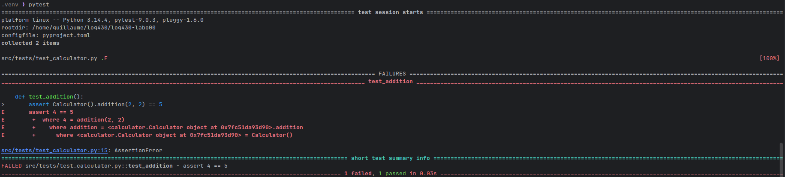
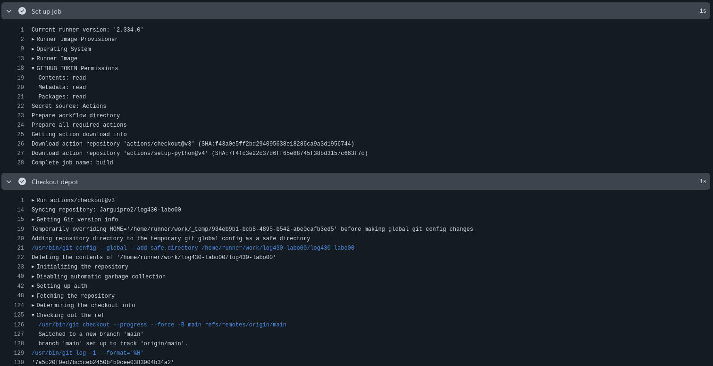

## Rapport laboratoire 00
### Guillaume Jarry  - JARG6630201
### ÉTS - LOG430 - Architecture logicielle - Été 2026

--- 

## Questions

---

### 1. Si l'un des tests échoue à cause d'un bug, comment pytest signale-t-il l'erreur et aide-t-il à la localiser ? Rédigez un test qui provoque volontairement une erreur, puis montrez la sortie du terminal obtenue.

pytest montre l'erreur en spécifiant le fichier de test et le nom de la fonction avec le test qui échoue avec une sortie style breadcrumbs ou il est possible de voir l'erreur directement dans la console.

### 2. Que fait GitHub pendant les étapes de « setup » et « checkout » ? Veuillez inclure la sortie du terminal GitHub CI dans votre réponse.

Durant l'étape de setup, GitHub provisionne un environnement ou l'on pourra exécuter des commandes.

Durant l'étape de checkout, GitHub télécharge le code source de l'application dans l'environnement.

## 3.

## Déploiement

---
